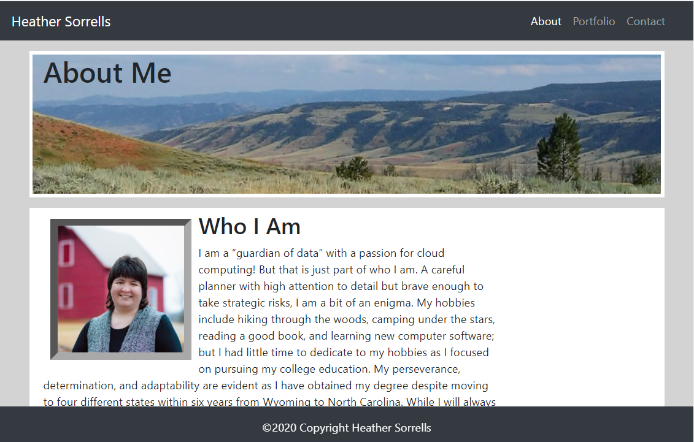

# Personal Portfolio Page
Welcome to my personal portfolio page! Here you will discover a little history about me and some of my hopes for the future. Don't miss my portfolio page which showcases links to some of my most recent projects and some favorites. You will also find my contact information on the contact page.

## Deployed Website

[My Portfolio](https://hlsorrells.github.io/)

## Table of Contents

  * [Site Description](#site-description)
  * [Technology Used](#technology-used)
  * [Future Improvements](#future-improvements)
  * [Screenshots of Application](#screenshots-of-application)
  * [Author](#author)

## Site Description
This is a three-page website that provides background information on myself on the home page, showcases links to some of my recent projects, and provides my contact information. I chose to go with a more modern but natural color palette as this seemed to be the best backdrop for my photos and easy on the eyes. I tried to make the site as readable as possible on large screen sizes by limiting the paragraph width to 75 characters and reducing the whitespace in the sections. I made the project GIFs large for better visibility of details and used the background color behind the GitHub repo links to help them stand out from their respective GIFs.

## Technology Used
 - HTML
 - CSS
 - Bootstrap

## Future Improvements
My next step will be to include some particle.js effects into my background. 

## Screenshots of Application

*Screenshot of the home page*

## Author
[Heather Sorrells](mailto:hlsorrells.dev@gmail.com)